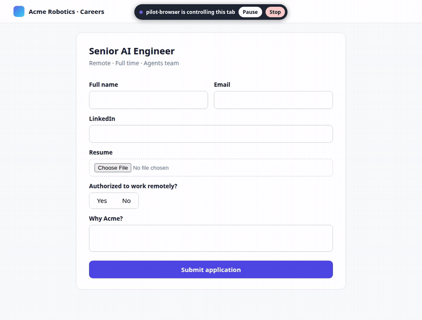

# pilot-browser

**Let AI agents drive your real, logged-in browser, with a visible cursor, human takeover, and approvals for anything consequential. MCP-native.**

[](https://github.com/ajstars1/pilot-browser/actions/workflows/ci.yml)
[](https://www.npmjs.com/package/@pilot-browser/mcp)
[](LICENSE)



<sub>Real recording: Claude-style agent → pilot-browser MCP server → real Chrome, on a fictional job form (supervised mode). Re-record with `npm run demo:record`.</sub>

Most browser agents run a fresh headless browser with none of your logins, or ship a forked browser. pilot-browser attaches to the **Chrome, Brave or Edge you already use**, through the browser's own consent prompt (Chromium 144+). The agent works in a tab of its own; you watch its cursor move and can step in at any moment.

- **Your browser, your sessions:** no fork, no profile copying, no cookie export.
- **You stay in control:** clicking in the agent's tab pauses it. The agent can't see the page while you drive, so passwords and 2FA codes you type never reach the model.
- **Approvals, at the level you choose:** four modes from *ask before everything* to *never ask*. The default asks before submitting, paying, sending, deleting and uploading.
- **Injection-resistant by construction:** an origin allowlist, destination checks from the live DOM, cross-site copy checks and tamper-proof controls hold even when the model is fooled. They're tested against a fully compromised agent on every CI run ([security model](docs/SECURITY.md)).
- **MCP-native:** works from Claude Code, Cursor, or any MCP client.

> **Status: 0.1, early.** Tested on Linux with Chrome 154; CI covers Linux, macOS and Windows. Expect rough edges and breaking changes before 1.0.

## Quick start (Claude Code)

1. Open Chrome (or Brave / Edge) and visit `chrome://inspect/#remote-debugging` (`brave://…`, `edge://…`). Tick **Allow remote debugging for this browser instance**. This is a one-time step.
2. Add the server:
   ```bash
   claude mcp add pilot-browser -- npx -y @pilot-browser/mcp
   ```
3. Start a new session and ask, e.g.: *"Use pilot-browser to open github.com/notifications and summarize my unread notifications."*
4. Your browser asks **Allow** once per session. Click it, then watch the agent work in its own tab.

Other MCP clients: run `npx -y @pilot-browser/mcp` as a stdio server. On native Windows use `"command": "cmd", "args": ["/c", "npx", "-y", "@pilot-browser/mcp"]`. Requires Node 22+.

## You stay in control

The pill at the top of the agent's tab shows what it's doing.

| | |
|---|---|
|  | **Working.** Press **Pause**, or just click or type in the tab, to take over. Press **Hand back** when done. **Stop** ends the session. |
|  | **Approval.** Depending on your [mode](#modes-and-settings), consequential steps wait for **Approve**. The approval covers that exact action on that exact page, once. |
|  | **Handoff.** For logins, 2FA and CAPTCHAs the agent asks you to do it. It can't see the page until you press **Done**. |

The agent can't press these buttons and the page can't fake them; see [SECURITY.md](docs/SECURITY.md).

## Tools

| Tool | What it does |
|---|---|
| `browser_connect` | Attach to your running browser, or launch a managed one with its own profile. Takes `allowedOrigins`. |
| `browser_navigate` | Go to a URL within the allowed origins. |
| `browser_read_page` | Accessibility snapshot with refs, clipped to the viewport by default (`filter: "all"` for reading). |
| `browser_click` / `browser_type` / `browser_select` / `browser_check` / `browser_press_key` / `browser_scroll` | Act on refs from the latest page, with real (trusted) input. |
| `browser_upload` | Attach files from your configured `uploadDir` only. |
| `browser_dialog` | Answer alert/confirm/prompt dialogs. |
| `browser_screenshot` | Viewport PNG, optionally labelled with refs. |
| `browser_handoff` / `browser_wait_for_user` | Ask you to do something in the tab, and wait for you. |
| `browser_disconnect` | Close the agent's tab and detach; your browser stays open. |

Every action quotes the `observationId` of the page it was planned on, so the agent never clicks based on a stale page.

## Modes and settings

Pick how much the agent may do without asking:

| Mode | Asks you before… | Good for |
|---|---|---|
| `manual` | every click, typing, upload and submit | First runs, sensitive sites |
| `supervised` *(default)* | submits, uploads, sends, deletes, payments, typing data copied from another site | Everyday use |
| `auto` | only payments/purchases, deletes, destructive dialogs, and cross-site copies | Repetitive work you trust, e.g. job applications |
| `full-auto` | nothing | Unattended runs in a managed profile |

Hard rails stay on in every mode: the origin allowlist, the upload folder, checks before clicks that would leave the allowed sites, and your Pause / Stop.

```bash
npx @pilot-browser/mcp config                                # show current settings
npx @pilot-browser/mcp config set mode auto
npx @pilot-browser/mcp config set uploadDir ~/Documents/resumes   # enables uploads from this folder only
npx @pilot-browser/mcp config set approvalTimeoutSeconds 300
```

Settings live in `~/.pilot-browser/config.json` and are re-read on every `browser_connect`, so changes apply to the next session without restarting your MCP client. **No MCP tool can change them**, so the model can't loosen its own leash. Env vars override the file: `PILOT_MODE`, `PILOT_UPLOAD_DIR`, `PILOT_APPROVAL_TIMEOUT`, `PILOT_PROFILE_DIR`, plus `PILOT_CHROME` for the managed-mode browser binary.

## Supported

| | Chrome / Brave / Edge | Firefox |
|---|---|---|
| Linux / macOS / Windows | attach + managed | planned (WebDriver BiDi, managed first) |

On WSL with a Windows browser you need [mirrored networking](docs/ARCHITECTURE.md#platform-support).

## How it works

pilot-browser is a TypeScript MCP server built on [vercel-labs/agent-browser](https://github.com/vercel-labs/agent-browser). That project is a Rust engine that drives Chromium over the DevTools Protocol.
- **Attach mode** uses Chromium's approval-mode endpoint. **Managed mode** launches a browser on a dedicated profile.
- **The overlay** (cursor, pill, controls) is injected into the agent's tab only.
- **Policy, approvals, the interaction lease and verification** all run outside the model.

Details: [ARCHITECTURE.md](docs/ARCHITECTURE.md) · [SECURITY.md](docs/SECURITY.md).

| Package | |
|---|---|
| [`@pilot-browser/mcp`](packages/mcp) | The MCP server (`pilot-browser-mcp`) |
| [`@pilot-browser/driver-agent-browser`](packages/driver-agent-browser) | Chromium driver built on agent-browser |
| [`@pilot-browser/core`](packages/core) | Engine-neutral contract, lease, overlay, policy, risk and taint checks |

## Development

```bash
git clone https://github.com/ajstars1/pilot-browser && cd pilot-browser
npm install && npm run build
npm run typecheck && npm test   # unit tests
npm run test:e2e                # real headless Chrome: driver, MCP over stdio, injection suite
```

To use your checkout from Claude Code: `claude mcp add pilot-browser -- node "$PWD/packages/mcp/dist/bin.js"`. See [CONTRIBUTING.md](CONTRIBUTING.md).

## License

[Apache-2.0](LICENSE). Built on [agent-browser](https://github.com/vercel-labs/agent-browser) (Apache-2.0).
